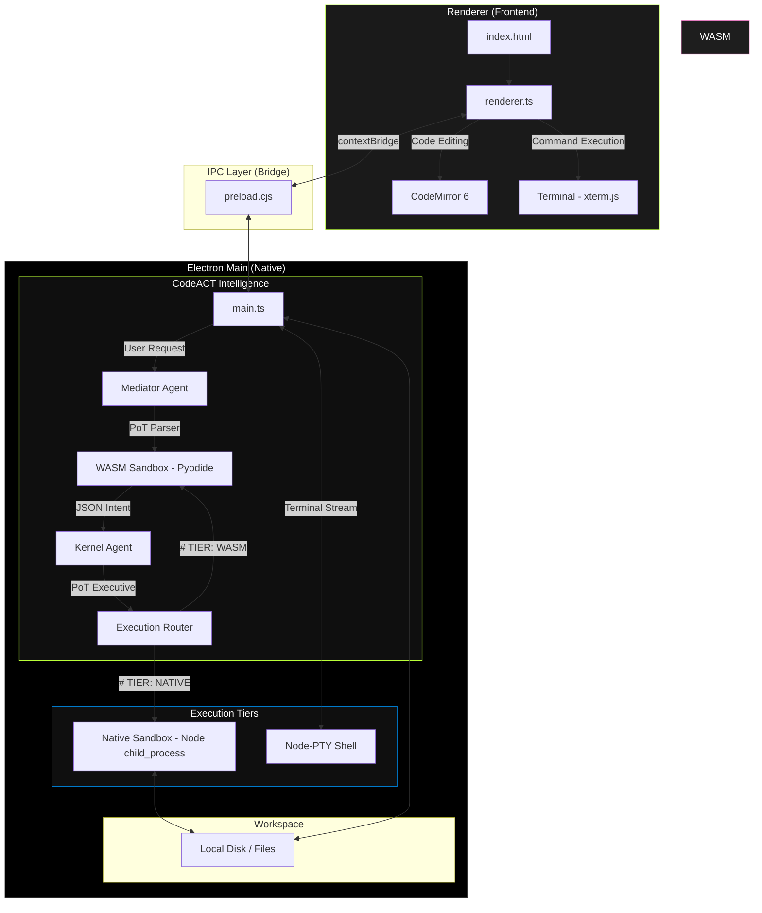

# CodeACT IDE: Architectural Review Graph

This graph visualizes the internal "Program-of-Thoughts" flow and the component relationships within the project.

### Key Component Review:

| Component | Responsibility | Risk Level |
| :--- | :--- | :--- |
| **Mediator Agent** | Parses user intent into numerical tokens using a WASM Python script. Prevents "prompt leakage" to the Kernel. | Low |
| **Kernel Agent** | Generates the Executive Program-of-Thought script. It "guesses" the solution by writing code. | High (Execution) |
| **Execution Router** | Determines if a thought is safe for WASM or requires Native access. | Medium |
| **Node-PTY** | Direct bridge to the host OS shell. Powers the real-deal terminal experience. | High (Security) |
| **CodeMirror 6** | Modern, modular editor providing the "IDE" surface. | Low |

### The "Thinking" Data Flow:
1.  **Input**: User enters Natural Language in the AI Pane.
2.  **Mediate**: LLM writes a Python script → Runs in WASM → Returns a **Clean Token Map**.
3.  **Think**: LLM receives Token Map → Writes a **Native Python Script** to solve the task.
4.  **Act**: Script executes on Local OS → Returns `stdout`/`stderr`.
5.  **Observe**: Results are piped back to the UI in real-time.
